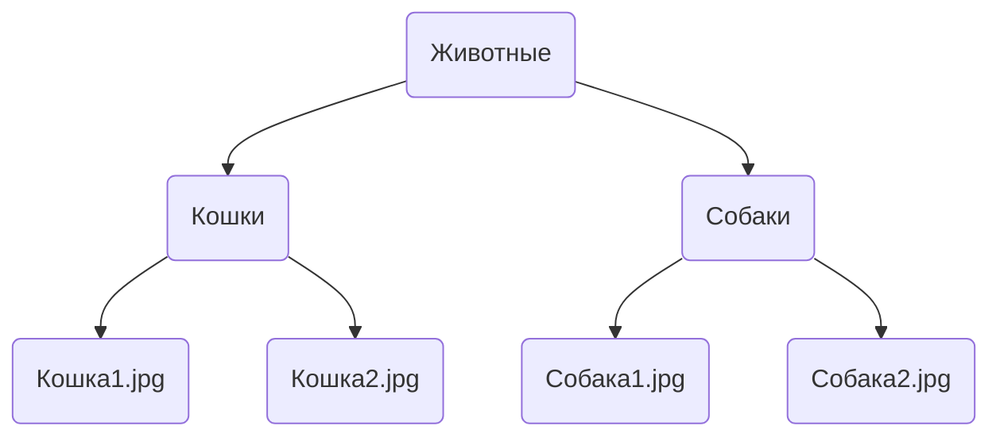
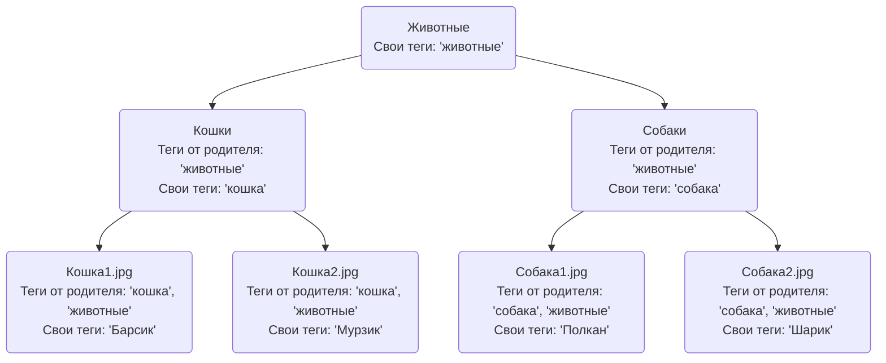
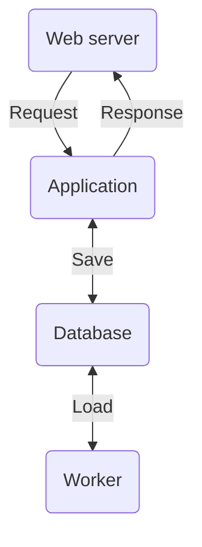
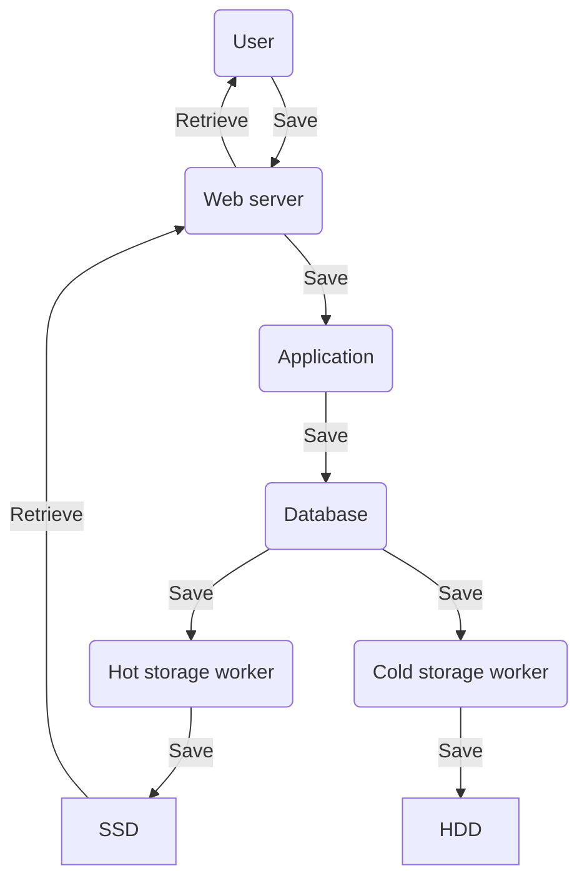

# Omoide

Система хранения и просмотра медиа данных. Например, хранилище для личного
фотоальбома или просто сохранённых картинок.

*Название с японского переводится как "воспоминания", а именно такие
воспоминания, которые объединяют с кем то и вызывают ностальгию.*

Практика показывает, что фотоальбомы, артбуки и сборники картин люди охотно
скачивают, но по факту толком не смотрят поскольку фильтровать и просматривать
контент в них довольно неудобно. Omoide решает как раз эту проблему.

Посмотреть систему в работе: [omoide.ru](https://omoide.ru)

## Регистрация в системе

По умолчанию для всего используется специальный анонимный пользователь. На
сайте есть возможность входа по логину-паролю, но не предусмотрено способов
регистрации. Пользователи добавляются в систему администратором вручную.

## Поисковая машина

Вся идея Omoide крутится вокруг того, что нужно быстро переваривать огромные
объёмы медиа материалов. Для этого их надо искать по тегам.

Пример поискового запроса (поддерживается + и - для тегов):

> кошки - рыжие + толстые + летние фотографии

Теги будут разрезаны по символам "+" и "-", так что в результате мы получим все
записи, у которых выставлены теги ("кошки", "толстые", "летние фотографии") и
нет тегов ("рыжие").

По соображениям безопасности, зарегистрированные пользователи не могут
выставлять свои картинки публично. Это доступно только специально оговоренным
публичным пользователям.

Когда ищет анонимный пользователь, ему выдаются только записи публичных
пользователей. Когда ищет зарегистрированный пользователь, ему выдаются только
его записи и записи тех пользователей, кто персонально предоставил для него
доступы к своим записям.

## Наследование тегов

Записи собраны в иерархию, в которой дочерние записи наследуют все теги своего
родителя.

Предположим, у нас есть некоторая структура хранения. Каталог "Животные" (в
Omoide оны называются коллекции), в котором два каталога - "Кошки" и "Собаки".
В каждом подкаталоге по две записи с фотографией животных.

Теги будут унаследованы следующим образом:

## Архитектура

Система состоит из трёх элементов:

1. Web server - в данном случае используется NGINX. Он отдаёт пользователям
   странички и картинки.
2. Application - веб приложение, написанное на python с использованием FastAPI.
3. Database - база данных, в данном случае PostgreSQL.
4. [Worker](#worker) - демон, сохраняющий пользовательские данные на
   диск.

## Worker

Воркер в Omoide это выделенный компонент, который осуществляет взаимодействие с
файловыми системами.

### Основная идея

Omoide изначально написана как не очень безопасная. Предполагается,
что в системе так или иначе есть баги и уязвимости, которые рано или поздно
приведут к утечкам данных и получению привилегированного доступа.
Предполагается, что контент в системе не имеет особой коммерческой ценности,
поэтому такая установка не должна создавать больших проблем.

Основным опасностями системы предполагаются:

1. Случайное удаление пользователем собственных данных.
2. Получение злоумышленником привилегированного доступа к пользовательскому
   аккаунту с последующим:
    - Удалением всех материалов пользователя.
    - Загрузкой контента до полного заполнения хранилища и итоговым отказом в
      обслуживании для всех пользователей.
3. Физический отказ серверов с полным разрушением файловой системы.

### Принятые проектные решения

1. Веб приложение полностью отвязано от файловых систем хранилищ данных. Доступ
   какого угодно уровня не даст возможности злоумышленнику удалить данные.
2. Переток данных в хранилища осуществляется через базу данных, куда попадают
   файлы пользователя в виде blob. Через какое-то время воркеры должны будут
   забрать их оттуда. Предполагается, что 3-5 гигабайт пользовательских данных
   временно хранимых в базе не будут представлять большой проблемы.
3. Воркеров должно быть как минимум два и они должны сохранять данные в два
   независимых хранилища.
4. Воркеры ни при каких обстоятельствах не могут удалять данные из файловой
   системы. В том числе им нельзя перезаписывать существующие файлы. Но они
   могут удалять данные из базы после скачивания.
5. Воркеры не знают друг про друга и не синхронизируются между собой (за
   исключением удаления данных из базы после окончания работы всех воркеров).
6. Любые серьёзные операции синхронизации данных между хранилищами, а также
   удаление ненужных данных производится администратором вручную с
   использованием офлайн инструментов.
7. Предполагается наличие "горячего" (hot) и "холодного" (cold) хранилищ.
   Горячее обслуживает отдачу файлов пользователей, холодное выступает в
   качестве бэкапа и в норме никем не запрашивается. Предполагается, что
   горячее расположено на быстрых SSD дисках, холодное на медленных HDD. Данные
   в них одни и те же.
8. Логика работы воркеров по своей сути похожа на синхронную репликацию.
9. Неконсистентность данных между хранилищами рассматривается как меньшее зло
   нежели потеря каких то данных.

### Схема потоков данных

