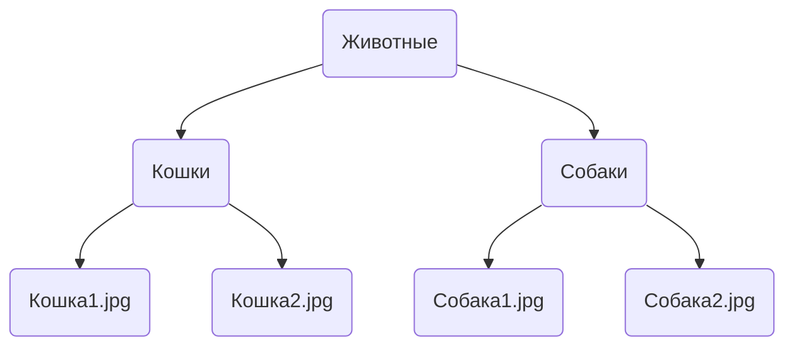
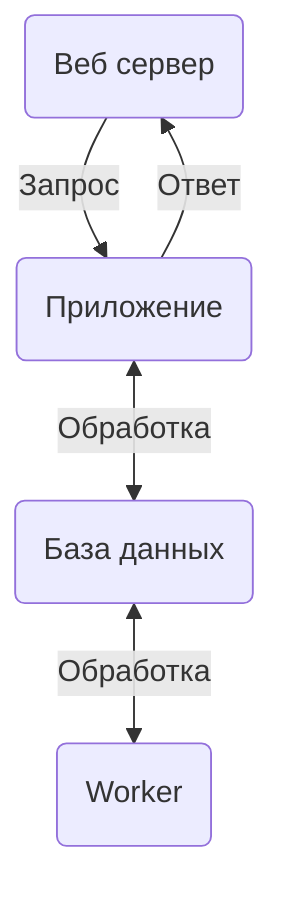
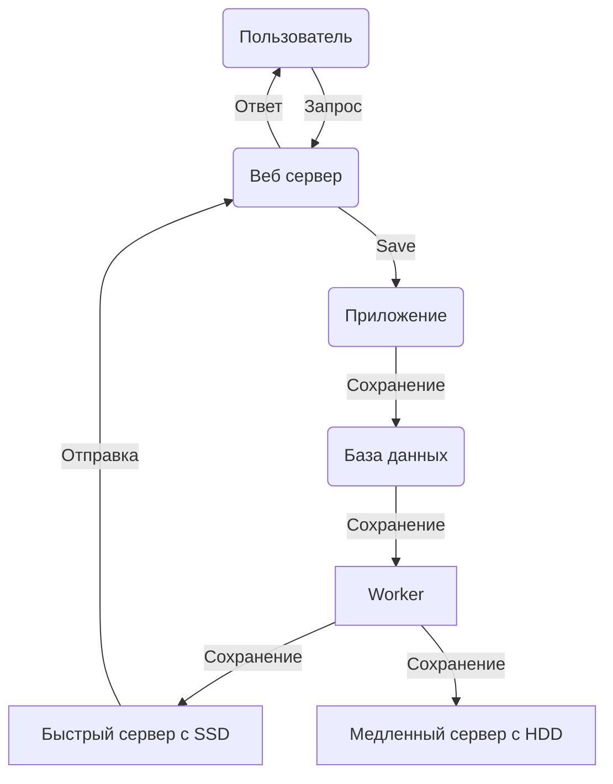

# Omoide

Система хранения и просмотра картинок. Может быть хранилищем для личного
фотоальбома или просто сборником мемов.

*Название с японского переводится как "воспоминания", а именно такие
воспоминания, которые объединяют с кем то и вызывают ностальгию.*

Практика показывает, что фотоальбомы, артбуки и сборники картин люди охотно
скачивают, но по факту толком не смотрят поскольку фильтровать и просматривать
контент в них довольно неудобно. Omoide решает как раз эту проблему.

Посмотреть систему в работе: [omoide.ru](https://omoide.ru)

## Права доступа

Пользователи в системе бывают трёх видов:

* Публичные.
* Приватные.
* Анонимные.

Публичный пользователь это зарегистрированный пользователь, публикации
которого видит кто угодно.

Приватный пользователь это зарегистрированный пользователь, который видит
только свой контент, а также то, что ему разрешили видеть в своих коллекциях
другие приватные пользователи. Соответственно, его контент могут видеть только
те приватные пользователи, которым был дан соответствующий доступ.

Анонимный пользователь выдаётся всем остальным сразу, без регистрации. Он
ничего не может публиковать и может смотреть только контент публичных
пользователей.

## Поисковая машина

Вся идея Omoide крутится вокруг того, что нужно быстро переваривать огромные
объёмы медиа материалов. Для этого их надо искать по тегам.

Пример поискового запроса (поддерживается + и - для тегов):

> кошки - рыжие + толстые + летние фотографии

Теги будут разрезаны по символам `+` и `-`, так что в результате мы получим все
записи, у которых выставлены теги ("кошки", "толстые", "летние фотографии") и
нет тегов ("рыжие").

Поиск учитывает права доступа, вы сможете найти только те материалы, к которым
у вас есть доступ.

## Наследование тегов

Записи собраны в иерархию, в которой дочерние записи наследуют все теги своего
родителя.

Предположим, у нас есть некоторая структура хранения. Коллекция `Животные`, в
которой находятся две коллекции - `Кошки` и `Собаки`.
В каждой из них фотографией животных.

На коллекции "Животные" выставлен тег "животные" и он спустится вниз по всему
дереву. На коллекции "Кошки" выставлен тег "кошка" и его унаследуют все
дочерние записи коллекции. Аналогично с коллекцией "Собаки" и её тегом
"собака". На конечных записях могут быть выставлены дополнительные теги,
например имена животных. Но поскольку у конечных записей потомков уже нет, их
теги останутся только при них.

## Архитектура

Система состоит из трёх элементов:

1. Веб сервер - в данном случае используется NGINX. Он отдаёт пользователям
   странички и картинки.
2. Приложение - веб приложение, написанное на python с использованием FastAPI.
3. База данных - база данных, в данном случае PostgreSQL.
4. Воркер - демон, сохраняющий пользовательские данные на диск.

## Воркер

Воркер в Omoide это выделенный компонент, который осуществляет взаимодействие с
файловыми системами.

### Основная идея

Omoide изначально написана как не очень безопасная. Предполагается,
что в системе так или иначе есть баги и уязвимости, которые рано или поздно
приведут к утечкам данных и получению привилегированного доступа.
Предполагается, что контент в системе не имеет особой коммерческой ценности,
поэтому такая установка не должна создавать больших проблем.

Основным опасностями системы предполагаются:

1. Случайное удаление пользователем собственных данных.
2. Получение злоумышленником привилегированного доступа к пользовательскому
   аккаунту с последующим:
    - Удалением всех материалов пользователя.
    - Загрузкой контента до полного заполнения хранилища и итоговым отказом в
      обслуживании для всех пользователей.
3. Физический отказ серверов с полным разрушением файловой системы.

### Принятые проектные решения

1. Веб приложение полностью отвязано от файловых систем хранилищ данных. Доступ
   какого угодно уровня не даст возможности злоумышленнику удалить данные.
2. Переток данных в хранилища осуществляется через базу данных, куда попадают
   файлы пользователя в виде blob. Через какое-то время воркер должен будет
   забирать их оттуда. Предполагается, что 3-5 гигабайт пользовательских
   данных, временно хранимых в базе, не будут представлять большой проблемы.
3. Воркер сохраняет данные в два независимых хранилища.
4. Воркер ни при каких обстоятельствах не может удалять данные из файловой
   системы. В том числе ему нельзя перезаписывать существующие файлы. Но он
   может удалять данные из базы после скачивания.
5. Любые серьёзные операции синхронизации данных между хранилищами, а также
   удаление ненужных данных производится администратором вручную с
   использованием офлайн инструментов.
7. Предполагается наличие "горячего" (hot) и "холодного" (cold) хранилищ.
   Горячее обслуживает отдачу файлов пользователей, холодное выступает в
   качестве бэкапа и в норме никем не запрашивается. Предполагается, что
   горячее расположено на быстрых SSD дисках, холодное на медленных HDD. Данные
   в них одни и те же.
8. Неконсистентность данных между хранилищами рассматривается как меньшее зло
   нежели потеря каких то данных.

### Схема потоков данных

