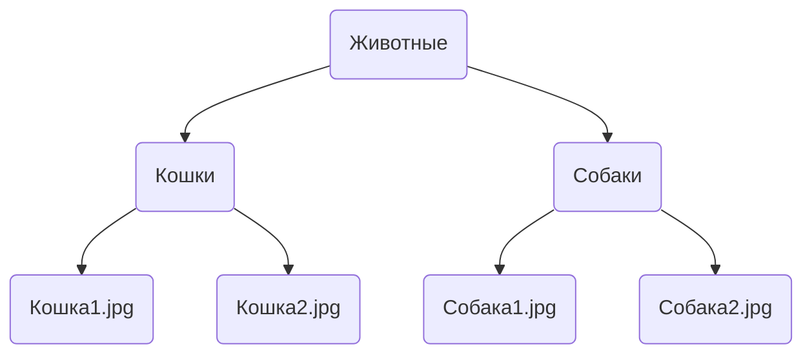

# Поисковый движок

Вся идея Omoide крутится вокруг того, что нужно быстро переваривать огромные
объёмы медиа материалов. Для этого был написан свой поисковый движок, позволяющий 
искать материалы по тегам.

Пример поискового запроса (поддерживается + и - для тегов):

> кошки - рыжие + толстые + летние фотографии

Теги будут разрезаны по символам `+` и `-`, так что в результате мы получим все
записи, у которых выставлены теги ("кошки", "толстые", "летние фотографии") и
нет тегов ("рыжие").

Поиск учитывает права доступа, вы сможете найти только те материалы, к которым
у вас есть доступ.

## Наследование тегов

Записи собраны в иерархию, в которой дочерние записи наследуют все теги своего
родителя.

Предположим, у нас есть некоторая структура хранения. Коллекция `Животные`, в
которой находятся две коллекции - `Кошки` и `Собаки`.
В каждой из них фотографией животных.

На коллекции "Животные" выставлен тег "животные" и он спустится вниз по всему
дереву. На коллекции "Кошки" выставлен тег "кошка" и его унаследуют все
дочерние записи коллекции. Аналогично с коллекцией "Собаки" и её тегом
"собака". На конечных записях могут быть выставлены дополнительные теги,
например имена животных. Но поскольку у конечных записей потомков уже нет, их
теги останутся только при них.
