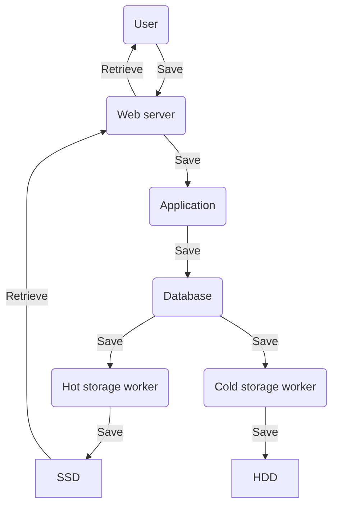

# Omoide Worker

Воркер в Omoide это выделенный компонент, который осуществляет взаимодействие с
файловыми системами.

## Основная идея

Приложение Omoide изначально написано как не очень безопасное. Предполагается,
что в системе так или иначе есть баги и уязвимости, которые рано или поздно
приведут к утечкам данных и получению привилегированного доступа.
Предполагается, что контент в системе не имеет особой коммерческой ценности,
поэтому такая установка не должна создавать больших проблем.

Основным опасностями системы предполагаются:

1. Получение злоумышленником привилегированного доступа к пользовательскому
   аккаунту с последующим:
    - Удалением всех материалов пользователя.
    - Загрузкой контента до полного заполнения хранилища и итоговым отказом в
      обслуживании для всех пользователей.
2. Физический отказ серверов с полным разрушением файловой системы.
3. Случайное удаление пользователем собственных данных.

## Принятые проектные решения

1. Веб приложение полностью отвязано от файловых систем хранилищ данных. Доступ
   какого угодно уровня не даст возможности злоумышленнику удалить данные.
2. Переток данных в хранилища осуществляется через базу данных, куда попадают
   файлы пользователя в виде blob. Через какое-то время воркеры должны будут
   забрать их оттуда. Предполагается, что 3-5 гигабайт пользовательских данных
   временно хранимых в базе не будут представлять большой проблемы.
3. Воркеров должно быть как минимум два и они должны сохранять данные в два
   независимых хранилища.
4. Воркеры ни при каких обстоятельствах не могут удалять данные из файловой
   системы. В том числе им нельзя перезаписывать существующие файлы. Но они
   могут удалять данные из базы после скачивания.
5. Воркеры не знают друг про друга и не синхронизируются между собой (за
   исключением удаления данных из базы после окончания работы всех воркеров).
6. Любые серьёзные операции синхронизации данных между хранилищами, а также
   удаление ненужных данных производится администратором вручную с
   использованием офлайн инструментов.
7. Предполагается наличие "горячего" (hot) и "холодного" (cold) хранилищ.
   Горячее обслуживает отдачу файлов пользователей, холодное выступает в
   качестве бэкапа и в норме никем не запрашивается. Предполагается, что
   горячее расположено на быстрых SSD дисках, холодное на медленных HDD. Данные
   в них одни и те же.
8. Логика работы воркеров по своей сути похожа на синхронную репликацию.
9. Неконсистентность данных между хранилищами рассматривается как меньшее зло
   нежели потеря каких то данных.

## Схема потоков данных

